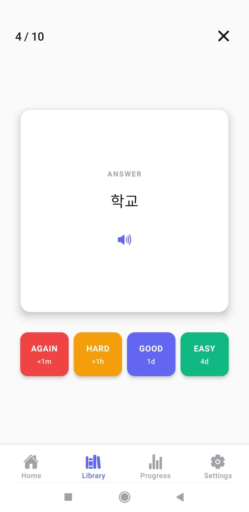
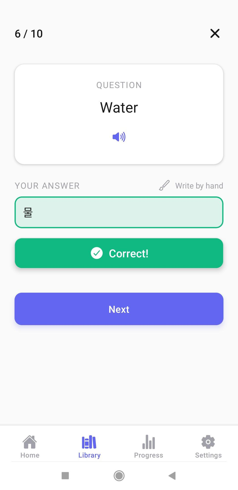
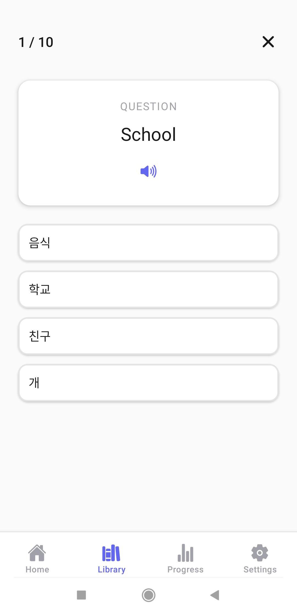
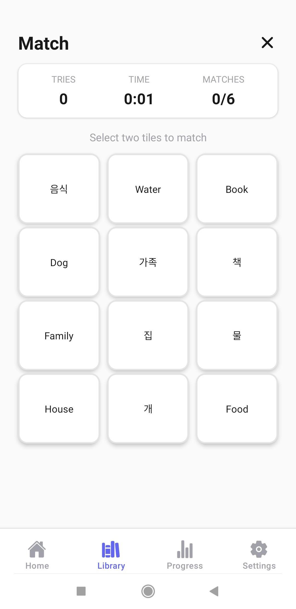
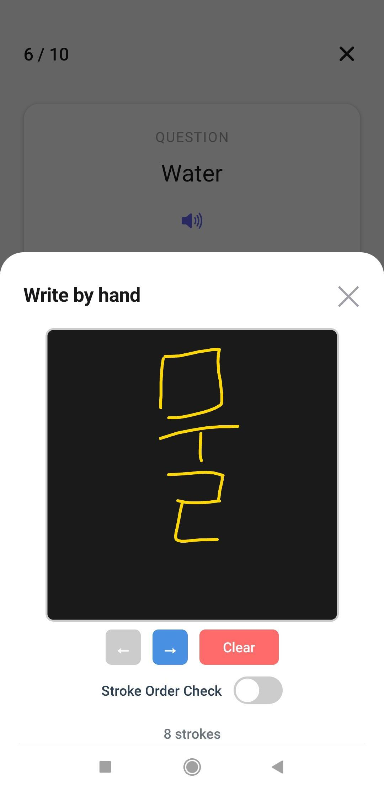
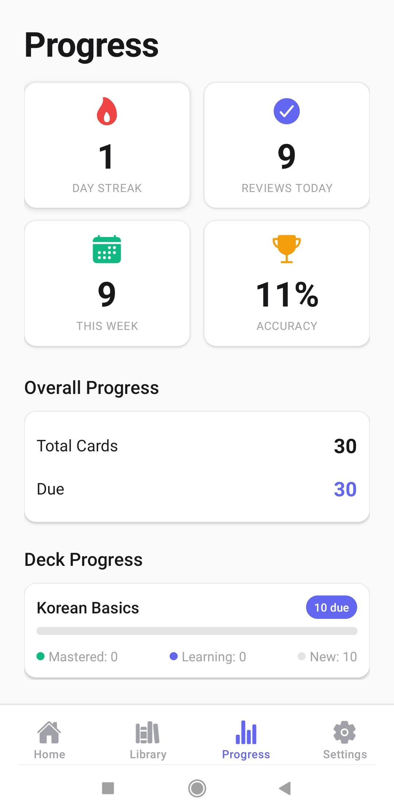
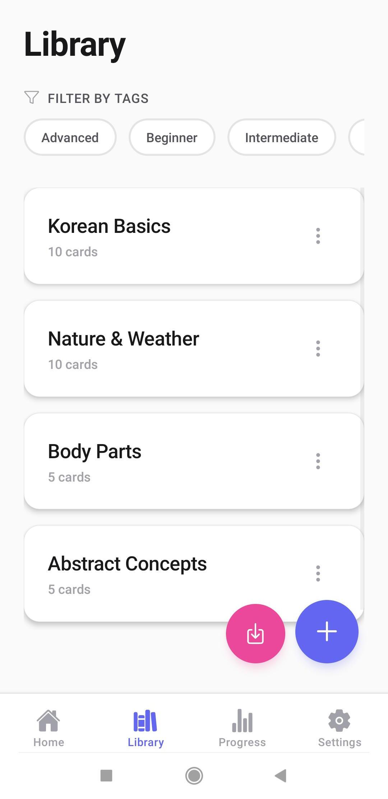
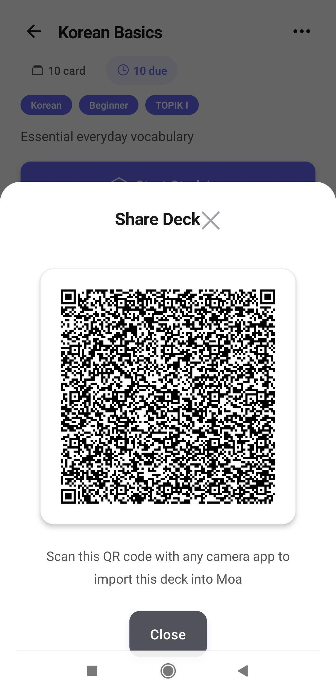

# 🪶 Moa - Learn Korean

> *Learn Korean, one word at a time.*

**Moa** (모아) means *"to gather"* in Korean — collecting words, knowledge, and small daily moments of progress.

A minimalist Korean learning app featuring spaced repetition flashcards, multiple study modes, handwriting recognition, and text-to-speech pronunciation. Built for learners who want to grow their Korean skills quietly and consistently.

**Free, offline-first, and privacy-focused.** All your data stays on your device. No account required. No ads, no subscriptions, no data collection.

---

## 📸 Screenshots

### Study Modes

  
  
  

  <em>Learn Mode • Write Mode • Test Mode</em>

### Features

  
  
  

  <em>Match Mode • Handwriting Recognition • Progress Tracking</em>

### Library & Sharing

  
  

  <em>Deck Library • QR Code Sharing</em>

---

## 🎮 Five Study Modes

### Learn Mode - Smart Flashcard Review
- Flip cards to reveal answers
- Rate your recall: Again / Hard / Good / Easy
- SM-2 spaced repetition algorithm adapts to your memory
- Progress tracked per card

### Write Mode - Handwriting Practice
- Draw Korean characters with your finger or stylus
- Google ML Kit recognition gives instant feedback
- Supports Korean and Japanese characters
- Practice writing with real-time validation

### Test Mode - Auto-Generated Quizzes
- Multiple choice questions from your decks
- Randomized answer options
- Instant feedback and scoring
- Session summary with accuracy percentage

### Match Mode - Timed Matching Game
- Match terms with definitions under time pressure
- Visual feedback with smooth animations
- Score tracking and completion time
- Fun, engaging way to reinforce vocabulary

### Browse Mode - Free Navigation
- Flip through cards without SRS pressure
- Simple Next/Previous navigation
- Perfect for quick review or casual browsing

**All modes include:**
- 🔄 Reverse cards toggle (swap question/answer)
- 🔊 Text-to-speech pronunciation buttons
- 🏷️ Tag-based filtering
- 🔀 Card shuffling option

---

## 🎧 Smart Text-to-Speech

- **Auto-language detection** - Automatically identifies Korean, Japanese, Chinese, English, French, Spanish, German, and Arabic
- **Speed control** - Adjust playback speed from 0.5x to 2.0x for better comprehension
- **Auto-play option** - Automatic pronunciation when cards appear
- **Per-tile TTS** - In Match mode, hear each tile pronounced independently

---

## ✍️ Handwriting Recognition

- **Google ML Kit integration** - Advanced on-device handwriting recognition
- **Real-time feedback** - See your strokes rendered instantly
- **Korean & Japanese support** - Download models for both languages
- **Infinite canvas** - Scroll seamlessly as you write
- **Modal input** - Pop-up handwriting keyboard for easy access

---

## 📊 Progress Tracking

- **Study streaks** - Track consecutive days of study for motivation
- **Accuracy statistics** - Monitor overall and per-deck performance
- **Card mastery levels** - See cards categorized as new / learning / mastered
- **Session history** - Review attempts, accuracy, and time invested
- **Motivational messages** - Get encouragement as you build streaks

---

## 📤 Import & Export

- **JSON format** - Export decks to portable `.moa` files
- **QR code sharing** - Generate and scan QR codes to share decks instantly
- **Deep linking** - Import decks via `moa://` URL scheme
- **File import** - Pick `.moa` files from your device storage
- **Validation** - Comprehensive error checking during import

---

## 🗂️ Deck Management

- Create custom decks with names, descriptions, and tags
- Add unlimited flashcards with front/back content
- Edit decks and cards anytime
- Tag-based organization for better categorization
- Deck-specific language settings
- Card list view with quick editing

---

## 🌍 Bilingual Interface

- **English** - Complete UI translation
- **French** - Full bilingual support
- Language switcher in Settings
- All user-facing text localized

---

## 🌸 Design Philosophy

Moa is built on core principles that guide every feature:

- **Small steps every day** - "한 걸음씩 (one step at a time)"
- **Minimal visual noise** - Clean typography, calm colors
- **Encouraging progress** - Not perfection
- **Personal learning tool** - Created to help learners review effectively, then shared with others

> *"Gather words, grow fluency. One Moa at a time."*

---

## 📥 Download

🚀 **Coming Soon** - Launching on Google Play Store

In the meantime, check out [ROADMAP.md](./ROADMAP.md) to see what's being worked on for v1.0 and beyond!

---

## 🛠️ For Developers

Want to contribute or build from source? See [APP.md](./APP.md) for technical documentation, architecture details, and development setup.

---

## 📄 License

All rights reserved.
